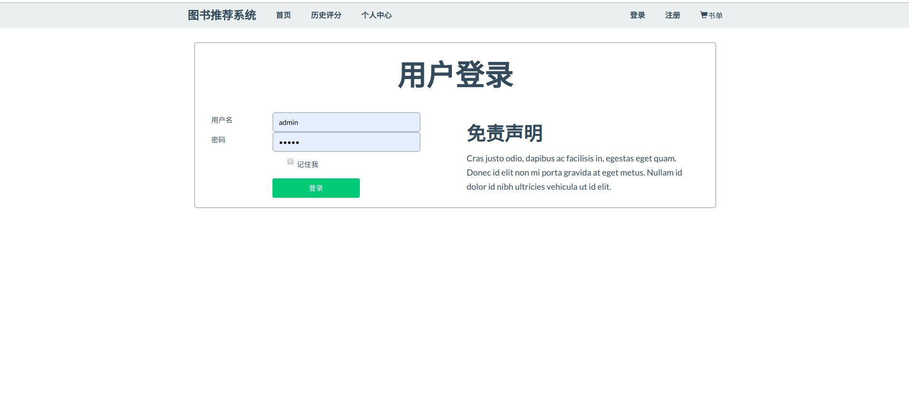
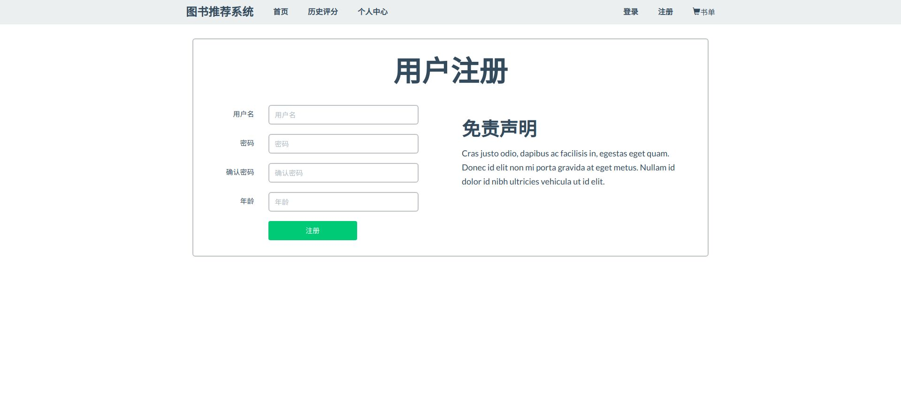
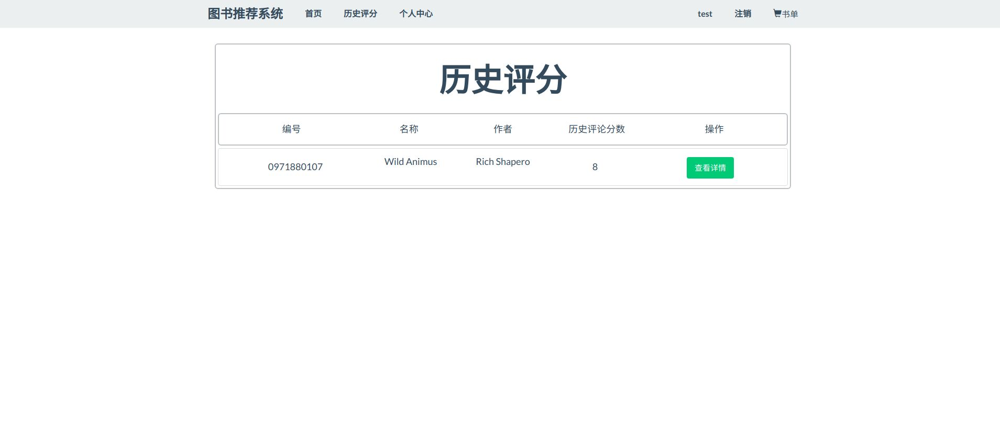
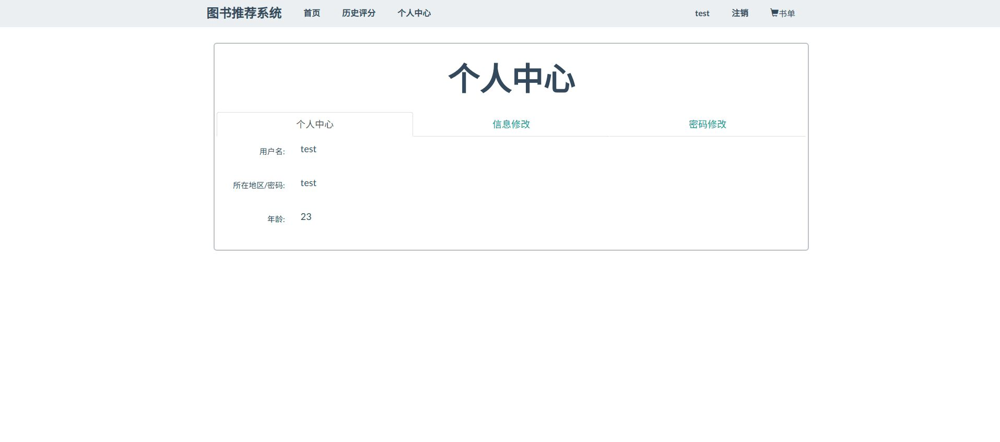
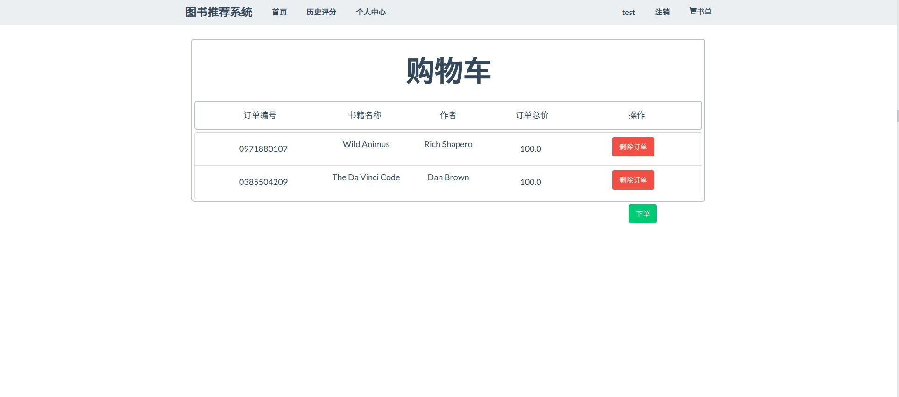
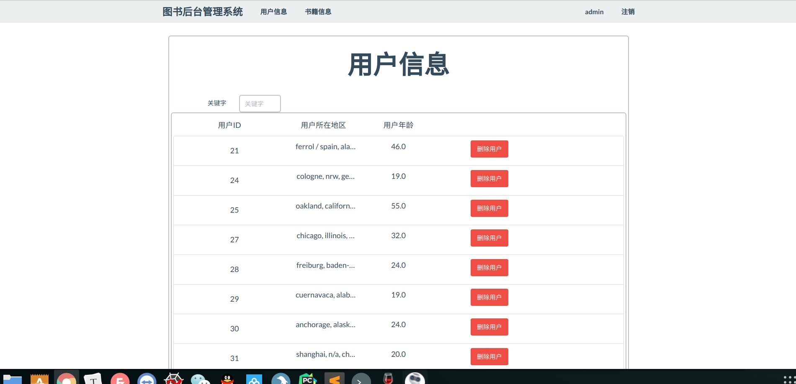
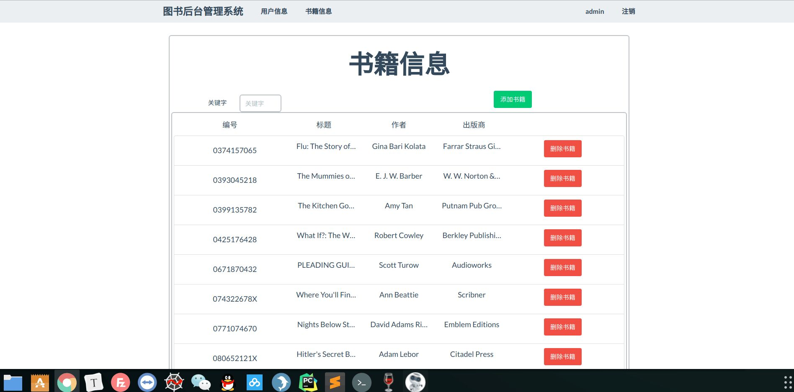
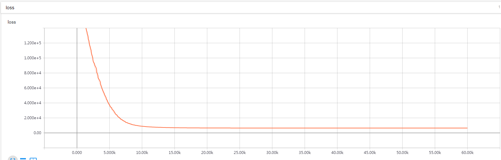

------------------------------------------------------------------------------------------------
# 智能图书推荐系统                          
------------------------------------------------------------------------------------------------

~~互联网访问地址[http://198.56.183.11:8080](http://198.56.183.11:8080)~~

数据集下载地址[http://www2.informatik.uni-freiburg.de/~cziegler/BX/](http://www2.informatik.uni-freiburg.de/~cziegler/BX/)

#### `主页`


#### `搜索功能`


#### `登录`


#### `注册`


#### `历史评分书单`


#### `书单`


#### `购物车`


#### `管理员 用户删除`


#### `管理员 书籍添加删除`



*  对图书数据使用tensorflow和GPU加速实现了初版的协同过滤算法
（为了tensorflow的tensor运算，所以会创建比较大的矩阵，会初始化2个约27W乘10W的矩阵）
作者训练环境配置：
```       
环境：ubuntu 
内存：64G
显卡：TaiTanXP * 4  （4*12G）
```
速度有比较大的提升。一天内可以训练完成。但是内存占用极高。接近42G内存。
所以在git上面CF4TensorFlow.py这个文件中第12行：    
```
Rating=Rating[:5000]   
```
设置了一个切片区间，默认使用5000，你可以按你的配置修改这个参数。
作者选择 Epoch 60000 Loss函数曲线 
<br>
<br>

### 功能清单

```
注册，登录，检索查询，评分，实时推荐，离线推荐，购物车，书单，删除购物车，删除书单。
管理员权限： 删除用户，添加书籍，删除书籍。
```

## 所需运行环境

* 使用python3.6作为编程语言。使用mysql作为数据库存储.
* 需要安装pandas,flask，pymysql.
*　安装方式:
```
    pip install pandas
    pip install flask
    pip install pymysql
```


## 联系作者：
QQ：470581985

## 项目源码介绍

图书推荐系统
```
----Flask-BookRecommend-Mysql\
    |----data                         >这个文件夹中存放数据集，数据集比较杂乱。
    |----image\                       
    |----web\                        >web端 
    |    |----logger.py               >日志记录
    |    |----config.yml              >配置参数
    |    |----logs                    >日志
    |    |----app.py                  >web入口
    |    |----utils.py                >辅助模块
    |----CF_use_python.py            >协同过滤：CF 算法
    |----CF_use_tensorflow.py        >使用tensorflow实现的协同过滤CF算法
    |----read_data_save_to_mysql.py  >读取data文件夹里面的书籍存储到数据库中
    |----README.md
```

## 项目启动方式：

数据集下载地址[http://www2.informatik.uni-freiburg.de/~cziegler/BX/]

* 将下载好的数据放入data文件夹下
* 运行read_data_save_to_mysql.py文件 将数据导入到mysql中。
  注意mysql的链接参数.默认是root,密码123456,端口是3300.如果你的不是，
  需要修改read_data_save_to_mysql和web/config.yml文件下的mysql的配置参数。
* 进入web文件夹,运行app.py
* 在浏览器上访问 127.0.0.1:8080  

* 使用下载数据中的UserID和其对应的Location作为账号密码登录网站。

* 系统管理员的账号：admin 密码：admin 通过这个账号密码进入后台管理

Example：
* `UserID/账号`：
    - 39027
* `UserName/密码`：
    - tempe, arizona, usa

## 项目思路：

本项目实现了3个图书推荐功能：
+ 热门书籍 
    + 是将评分排名最高的几本书推荐给用户
+ 猜你喜欢
    + 通过数据库SQL语句实现
    + ”看了这本书的人也看了XX书“
    + 主要逻辑是：
        + 首先查该用户的浏览记录
        + 通过浏览过的书籍，找到也看过这本书的人
        + 在也看过这本书的人中，找评分较高的书推荐给用户
+ 推荐书籍
    + 离线计算好的推荐表的信息。使用到了协同过滤算法
    + 之后会做成按天更新
    + 目前的项目是实时推荐的，使用sql语句实现的
    
##  wx赞赏码：如果对你有用或者你需要帮你改进此项目


